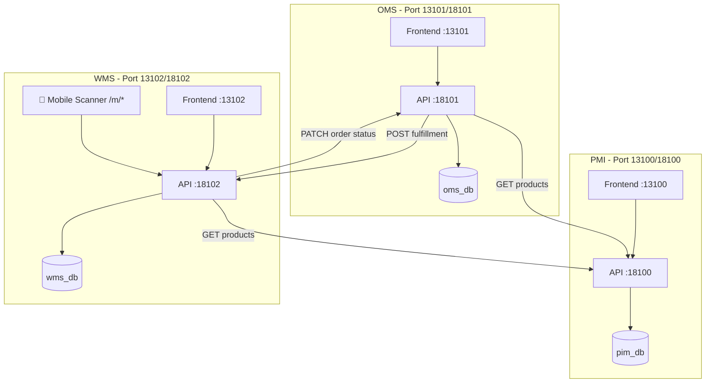
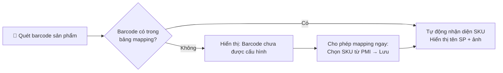
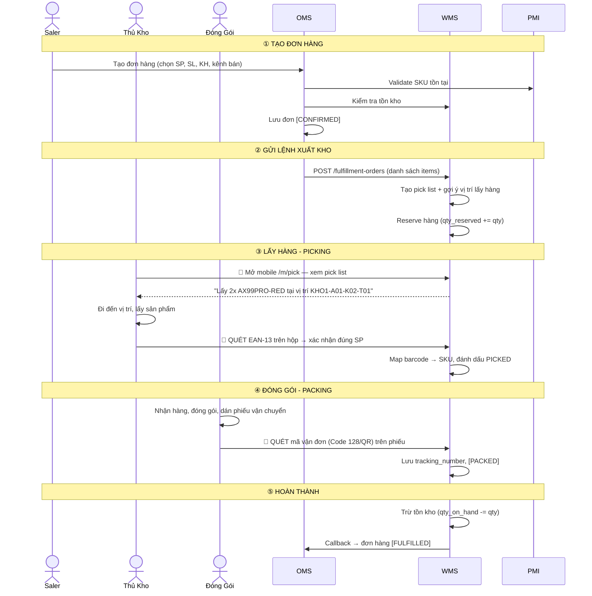
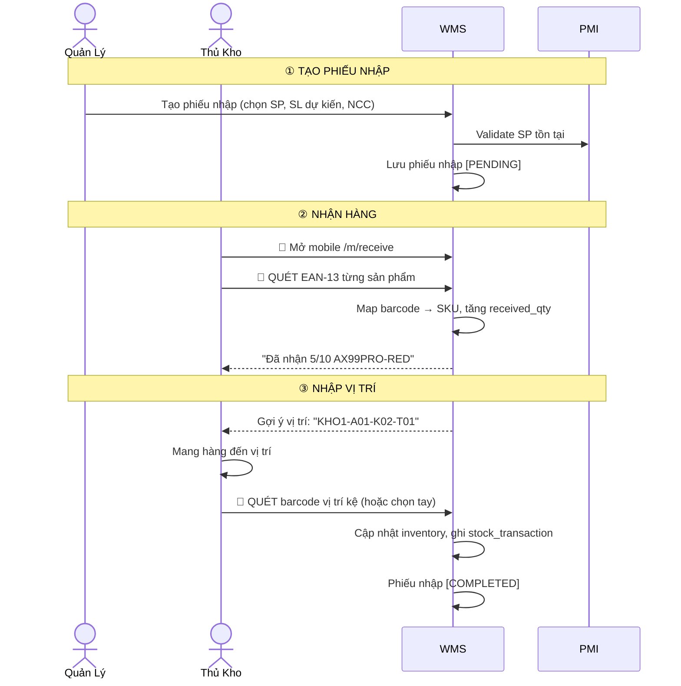
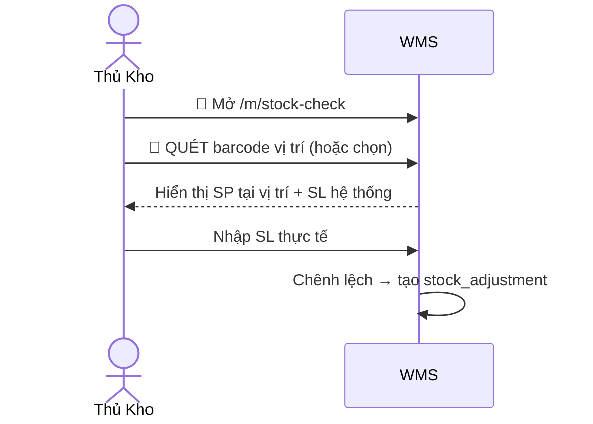
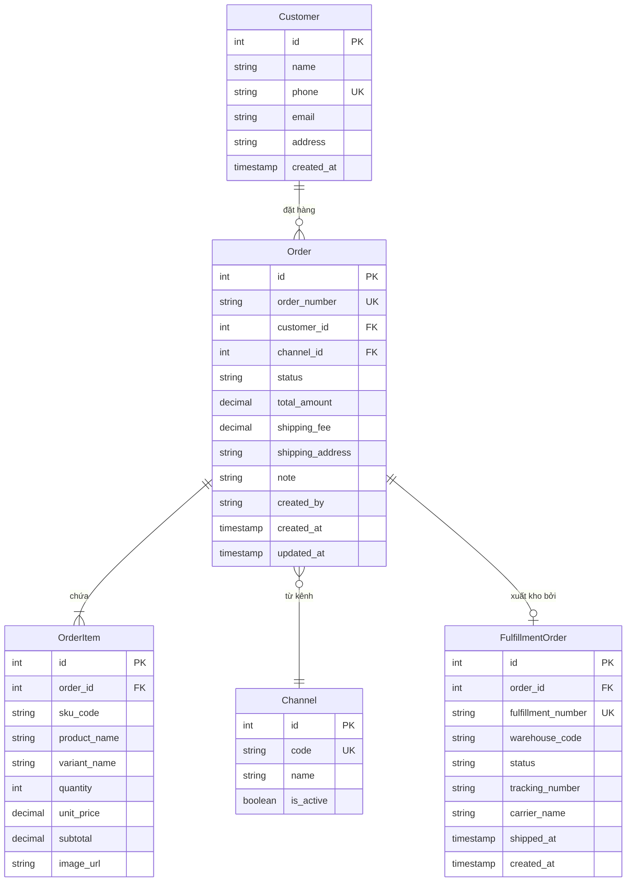
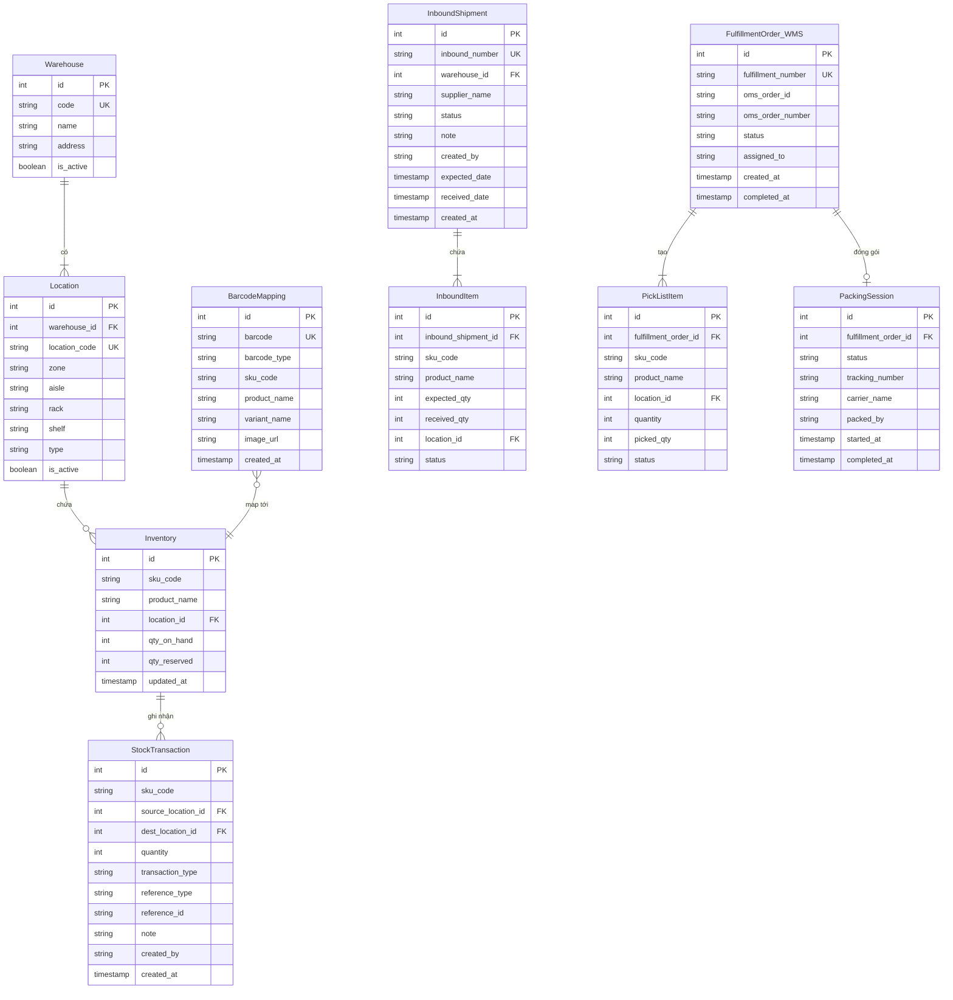
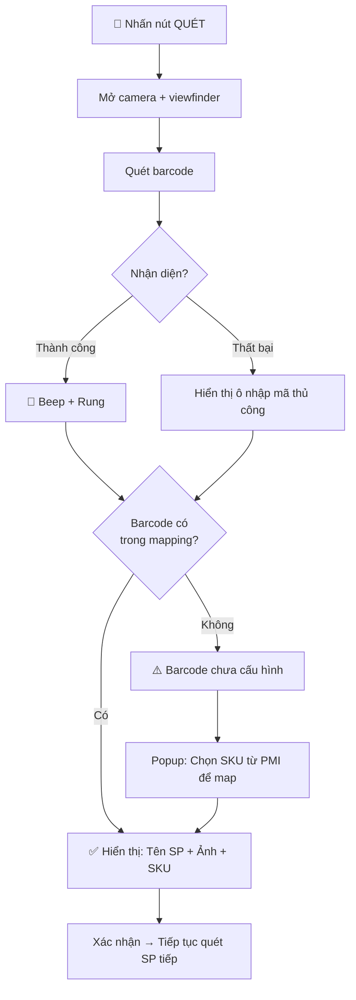

# Thiết Kế Hệ Thống PMI + OMS + WMS — TOP VN SPORT

## Tổng Quan

Thiết kế 3 hệ thống quản lý chuỗi cung ứng cho **TOP VN SPORT** (sản phẩm cầu lông: vợt, cầu, giày, phụ kiện):

| Hệ thống | Vai trò | Trạng thái |
|-----------|---------|------------|
| **PMI** (Product Information Management) | Quản lý thông tin sản phẩm, danh mục, biến thể, SKU, media | ✅ Đã hoàn thiện |
| **OMS** (Order Management System) | Quản lý đơn hàng thủ công, khách hàng, kênh bán | 🆕 Thiết kế mới |
| **WMS** (Warehouse Management System) | Quản lý kho, tồn kho, xuất/nhập, quét barcode mobile | 🆕 Thiết kế mới |

### Nguyên tắc thiết kế
- **MVC lean**: Tối giản, mở rộng sau
- **Cùng tech stack** với PMI: FastAPI + Next.js + PostgreSQL + Docker
- **Microservices nhẹ**: Mỗi hệ thống chạy độc lập, giao tiếp qua REST API
- **Không authentication**: Bỏ qua phân quyền giai đoạn đầu
- **Mobile-first barcode scanning**: Tối ưu cho quét barcode trên điện thoại
- **Barcode có sẵn**: Không in barcode, chỉ quét barcode sản phẩm (EAN-13) và mã vận đơn sàn TMĐT

---

## Kiến Trúc Tổng Quan



### Port Mapping

| Service | Port |
|---------|------|
| PMI Frontend / API / DB / MinIO | 13100 / 18100 / 15433 / 19005 |
| OMS Frontend / API / DB | 13101 / 18101 / 15434 |
| WMS Frontend / API / DB | 13102 / 18102 / 15435 |

---

## Hệ Thống Barcode & Scanning

> [!IMPORTANT]
> **Barcode có sẵn trên sản phẩm và phiếu vận chuyển — hệ thống chỉ CẦN QUÉT, không cần in.**

### 2 Loại Barcode Cần Quét

#### 1. Barcode Sản Phẩm (EAN-13)

Trên hộp/bao bì sản phẩm cầu lông (Yonex, Victor, Li-Ning...) có sẵn **EAN-13 barcode** (13 chữ số).

```
Ví dụ: 4550468123456 (Yonex - prefix Japan 450-459)
       6901234567890 (Li-Ning - prefix China 690-695)
       4710441234567 (Victor - prefix Taiwan 471)
```

**Hệ thống cần bảng mapping** để liên kết barcode → SKU:

| EAN-13 Barcode | SKU trong PMI | Tên sản phẩm |
|----------------|---------------|---------------|
| `4550468123456` | `AX99PRO-RED-4U` | Astrox 99 Pro - Đỏ - 4U |
| `4550468123463` | `AX99PRO-BLU-3U` | Astrox 99 Pro - Xanh - 3U |
| `6901234567890` | `AXFORCE80-BLK` | Axforce 80 - Đen |

#### 2. Barcode Vận Đơn (Code 128 / QR)

Từ sàn TMĐT và đơn vị vận chuyển, in trên phiếu giao hàng:

| Nguồn | Format Tracking Number | Loại barcode |
|-------|----------------------|--------------|
| **Shopee (SPX)** | `SPXVN02883837211B` | Code 128 + QR |
| **TikTok Shop** | Tracking number từ carrier | Code 128 + QR |
| **GHN** | `5ENLKKHD` (alphanumeric) | Code 128 |
| **GHTK** | `S160689.MN1.A15.123456789` | Code 128 |
| **J&T Express** | `812345678900` (12 số) | Code 128 |
| **Viettel Post** | 12 số, prefix VT/VTP | Code 128 + QR |

### Scanner Technology

```
Thư viện: html5-qrcode (hỗ trợ cả QR + EAN-13 + Code 128)
Camera: Rear camera (environment facing)
Decode: EAN-13 cho sản phẩm, Code 128/QR cho vận đơn
Fallback: Input thủ công nếu không quét được
```

### Barcode Mapping Flow



---

## Luồng Nghiệp Vụ

### Luồng 1: Xuất Kho (Outbound) — Nhập Tay

> [!NOTE]
> Giai đoạn đầu Saler nhập đơn thủ công, không kết nối API sàn TMĐT.



### Luồng 2: Nhập Kho (Inbound) — Chuẩn



### Luồng 3: Kiểm Kho



---

## PMI — Giữ Nguyên + Bổ Sung Nhỏ

> [!NOTE]
> PMI đã hoàn thiện. Chỉ bổ sung 1 endpoint để OMS/WMS tra cứu sản phẩm theo SKU.

### API bổ sung

```
GET /api/products/by-sku/{sku_code}
→ Trả về: product_name, variant_name, sku_code, price, weight, dimensions, image_url
```

---

## OMS — Order Management System

### Data Models



### Order Status Flow

```
DRAFT → CONFIRMED → PROCESSING → PICKING → PACKED → SHIPPED → COMPLETED
                                                                    ↑
Bất kỳ trạng thái nào trước SHIPPED → CANCELLED ──────────────────┘
```

| Status | Mô tả | Ai trigger |
|--------|-------|------------|
| `DRAFT` | Đơn nháp, chưa xác nhận | Saler |
| `CONFIRMED` | Đã xác nhận, chờ xuất kho | Saler |
| `PROCESSING` | Đã gửi lệnh xuất kho cho WMS | System (OMS→WMS) |
| `PICKING` | Thủ kho đang lấy hàng | WMS callback |
| `PACKED` | Đã đóng gói + quét mã vận đơn | WMS callback |
| `SHIPPED` | Đã giao cho vận chuyển | WMS callback |
| `COMPLETED` | Hoàn thành | Manual |
| `CANCELLED` | Hủy đơn | Saler |

### OMS API

| Method | Endpoint | Mô tả |
|--------|----------|-------|
| GET | `/dashboard/stats` | Thống kê đơn hàng, doanh thu |
| GET/POST | `/customers` | CRUD khách hàng |
| GET/PUT | `/customers/{id}` | Chi tiết / cập nhật KH |
| GET | `/orders` | Danh sách đơn (lọc status, channel, ngày, tìm kiếm) |
| POST | `/orders` | Tạo đơn mới |
| GET | `/orders/{id}` | Chi tiết đơn + items + fulfillment |
| PUT | `/orders/{id}` | Sửa đơn (khi còn DRAFT) |
| DELETE | `/orders/{id}` | Xóa đơn nháp |
| POST | `/orders/{id}/confirm` | Xác nhận → gửi WMS |
| POST | `/orders/{id}/cancel` | Hủy đơn |
| PATCH | `/orders/{id}/status` | Cập nhật status (WMS callback) |
| GET/POST | `/channels` | CRUD kênh bán |
| GET | `/products/search` | Proxy tìm SP từ PMI |

### OMS Frontend Pages

| Route | Trang |
|-------|-------|
| `/` | Dashboard — thống kê đơn, doanh thu, biểu đồ |
| `/orders` | Danh sách đơn — lọc, tìm, sắp xếp |
| `/orders` (create mode) | Tạo đơn — chọn KH, thêm SP từ PMI, nhập SL |
| `/orders` (detail mode) | Chi tiết đơn — timeline trạng thái, fulfillment info |
| `/customers` | Quản lý khách hàng — CRUD |
| `/channels` | Kênh bán hàng — Shopee, TikTok, Manual... |

---

## WMS — Warehouse Management System

### Data Models

> [!TIP]
> **Cấu trúc kho đơn giản**: Chỉ 2 bảng Warehouse + Location. Vị trí được mã hóa trong `location_code` (vd: `A01-K02-T01`). Mở rộng bảng Zone/Rack riêng khi cần.



### Bảng BarcodeMapping — Trái Tim Của Hệ Thống Quét

> [!IMPORTANT]
> Đây là bảng quan trọng nhất cho tính năng quét. Mỗi barcode EAN-13 trên hộp sản phẩm được map tới 1 SKU trong PMI.

```
barcode_type:
  - EAN13      → Barcode trên sản phẩm (Yonex, Victor, Li-Ning)
  - CODE128    → Barcode vận đơn (GHN, GHTK, Shopee...)
  - QR         → QR code (TikTok Shop, SPX...)
  - CUSTOM     → Mã tùy chỉnh
```

**Cách hoạt động:**
1. Lần đầu quét barcode mới → Hệ thống hỏi "Map barcode này tới SKU nào?" → Saler/Quản lý chọn SKU từ PMI
2. Lần sau quét cùng barcode → Tự động nhận diện sản phẩm, hiển thị tên + ảnh

### Location Code Format

Mã vị trí đơn giản, encode thông tin trong chuỗi:

```
Format: [Zone][Aisle]-K[Rack]-T[Shelf]
Ví dụ:  A01-K02-T01

A    = Khu A (zone)
01   = Lối đi 01 (aisle)
K02  = Kệ 02 (rack)
T01  = Tầng 01 (shelf)
```

| Location Type | Mô tả |
|---------------|-------|
| `STORAGE` | Vị trí lưu trữ chính |
| `RECEIVING` | Khu vực nhận hàng |
| `PACKING` | Khu đóng gói |
| `SHIPPING` | Khu giao hàng |

### Stock Transaction Types

| Type | Mô tả | qty_on_hand | qty_reserved |
|------|-------|-------------|--------------|
| `INBOUND` | Nhập kho | +qty | — |
| `OUTBOUND` | Xuất kho (pick hoàn thành) | -qty | -qty |
| `RESERVE` | Đặt trước cho đơn hàng | — | +qty |
| `UNRESERVE` | Hủy đặt trước | — | -qty |
| `TRANSFER` | Chuyển vị trí | source -qty, dest +qty | — |
| `ADJUSTMENT` | Điều chỉnh kiểm kho | ±qty | — |

> [!IMPORTANT]
> **Nguyên tắc vàng**: Mọi thay đổi tồn kho PHẢI tạo `StockTransaction`. Không bao giờ UPDATE qty trực tiếp.

### Fulfillment Status Flow

```
PENDING → PICKING → PICKED → PACKING → PACKED → SHIPPED
                                                    ↑
Bất kỳ trước PACKED → CANCELLED ───────────────────┘
```

### WMS API

| Method | Endpoint | Mô tả |
|--------|----------|-------|
| **Dashboard** | | |
| GET | `/dashboard/stats` | Thống kê kho |
| **Warehouse & Locations** | | |
| GET/POST | `/warehouses` | CRUD kho |
| GET | `/warehouses/{id}/locations` | Vị trí trong kho |
| POST | `/locations` | Tạo vị trí |
| PUT | `/locations/{id}` | Cập nhật vị trí |
| **Barcode Mapping** | | |
| GET | `/barcode-mappings` | Danh sách mapping |
| POST | `/barcode-mappings` | Tạo mapping barcode → SKU |
| PUT | `/barcode-mappings/{id}` | Sửa mapping |
| DELETE | `/barcode-mappings/{id}` | Xóa mapping |
| GET | `/barcode-mappings/lookup/{barcode}` | Tra cứu barcode → SKU |
| **Inventory** | | |
| GET | `/inventory` | Tồn kho (lọc SKU, kho, vị trí) |
| GET | `/inventory/check` | Kiểm tra tồn cho list SKU (OMS gọi) |
| GET | `/inventory/by-location/{location_id}` | Tồn kho tại vị trí |
| POST | `/inventory/adjust` | Điều chỉnh tồn kho |
| POST | `/inventory/transfer` | Chuyển vị trí |
| **Inbound** | | |
| GET/POST | `/inbound` | Danh sách / tạo phiếu nhập |
| GET | `/inbound/{id}` | Chi tiết phiếu nhập |
| POST | `/inbound/{id}/receive-scan` | Quét barcode nhận hàng |
| POST | `/inbound/{id}/put-away` | Nhập vị trí |
| PATCH | `/inbound/{id}/complete` | Hoàn thành phiếu nhập |
| **Fulfillment (Xuất kho)** | | |
| GET | `/fulfillment-orders` | Danh sách lệnh xuất |
| POST | `/fulfillment-orders` | Tạo lệnh xuất (OMS gọi) |
| GET | `/fulfillment-orders/{id}` | Chi tiết + pick list |
| POST | `/fulfillment-orders/{id}/start-pick` | Bắt đầu pick |
| POST | `/fulfillment-orders/{id}/scan-pick` | Quét EAN-13 xác nhận pick |
| POST | `/fulfillment-orders/{id}/complete-pick` | Hoàn thành pick |
| POST | `/fulfillment-orders/{id}/scan-pack` | Quét mã vận đơn |
| POST | `/fulfillment-orders/{id}/complete-pack` | Hoàn thành đóng gói |
| POST | `/fulfillment-orders/{id}/ship` | Xác nhận giao vận chuyển |
| POST | `/fulfillment-orders/{id}/cancel` | Hủy lệnh xuất |
| **Product Sync** | | |
| POST | `/products/sync` | Đồng bộ SP từ PMI |
| **Stock Transactions** | | |
| GET | `/stock-transactions` | Lịch sử giao dịch (audit log) |

### WMS Frontend — Desktop

| Route | Trang |
|-------|-------|
| `/` | Dashboard — tồn kho, phiếu nhập/xuất, cảnh báo hết hàng |
| `/warehouses` | Quản lý kho + vị trí |
| `/inventory` | Tồn kho — xem, lọc, tìm kiếm |
| `/barcode-mappings` | Cấu hình Barcode Mapping — bảng map EAN-13 → SKU |
| `/inbound` | Phiếu nhập kho — tạo, theo dõi |
| `/fulfillment` | Lệnh xuất kho — danh sách, trạng thái |
| `/transactions` | Lịch sử giao dịch kho |

### WMS Frontend — Mobile Scanner (📱 PWA)

> [!TIP]
> Route `/m/*` có layout riêng: không sidebar, nút lớn, tối ưu cho thao tác 1 tay. Hỗ trợ cài PWA trên điện thoại.

| Route | Trang | Hành động quét |
|-------|-------|---------------|
| `/m` | Menu chính | — |
| `/m/pick` | Danh sách lệnh pick | — |
| `/m/pick/{id}` | Chi tiết pick list | Quét EAN-13 từng SP |
| `/m/pack` | Danh sách chờ đóng gói | — |
| `/m/pack/{id}` | Đóng gói | Quét Code 128/QR mã vận đơn |
| `/m/receive` | Danh sách phiếu nhập | — |
| `/m/receive/{id}` | Nhận hàng | Quét EAN-13 từng SP nhận |
| `/m/receive/{id}/put-away` | Nhập vị trí | Chọn/nhập vị trí kệ |
| `/m/lookup` | Tra cứu | Quét bất kỳ barcode → hiển thị info |
| `/m/stock-check` | Kiểm kho | Chọn vị trí → nhập SL thực tế |

### Mobile Scanner UX



---

## Cấu Trúc Thư Mục

```
/home/lupca/projects/
├── PMI/                          # ✅ Đã hoàn thiện — giữ nguyên
│   ├── backend/
│   ├── frontend/
│   └── docker-compose.yml
│
├── OMS/                          # 🆕
│   ├── backend/
│   │   ├── main.py              # FastAPI routes
│   │   ├── models.py            # SQLAlchemy: Customer, Order, OrderItem, Channel, FulfillmentOrder
│   │   ├── schemas.py           # Pydantic schemas
│   │   ├── database.py          # DB connection
│   │   ├── services.py          # Business logic + PMI/WMS integration
│   │   ├── requirements.txt
│   │   └── Dockerfile
│   ├── frontend/
│   │   └── src/app/
│   │       ├── page.tsx         # Dashboard
│   │       ├── orders/          # Quản lý đơn hàng
│   │       ├── customers/       # Quản lý khách hàng
│   │       └── channels/        # Kênh bán hàng
│   └── docker-compose.yml
│
├── WMS/                          # 🆕
│   ├── backend/
│   │   ├── main.py              # FastAPI routes
│   │   ├── models.py            # SQLAlchemy: Warehouse, Location, Inventory, BarcodeMapping, etc.
│   │   ├── schemas.py           # Pydantic schemas
│   │   ├── database.py          # DB connection
│   │   ├── services.py          # Business logic + barcode mapping
│   │   ├── requirements.txt
│   │   └── Dockerfile
│   ├── frontend/
│   │   └── src/app/
│   │       ├── page.tsx         # Dashboard
│   │       ├── warehouses/      # Quản lý kho
│   │       ├── inventory/       # Tồn kho
│   │       ├── barcode-mappings/# Cấu hình barcode mapping
│   │       ├── inbound/         # Phiếu nhập kho
│   │       ├── fulfillment/     # Lệnh xuất kho
│   │       ├── transactions/    # Lịch sử kho
│   │       └── m/               # 📱 Mobile Scanner (PWA)
│   │           ├── layout.tsx   # Mobile layout riêng
│   │           ├── pick/        # Lấy hàng
│   │           ├── pack/        # Đóng gói
│   │           ├── receive/     # Nhận hàng
│   │           ├── lookup/      # Tra cứu
│   │           └── stock-check/ # Kiểm kho
│   └── docker-compose.yml
```

---

## Kế Hoạch Triển Khai

### Phase 1: Foundation (Tuần 1-2)
- [ ] Setup Docker Compose cho OMS + WMS
- [ ] Models, schemas, database, seed data cho OMS
- [ ] Models, schemas, database, seed data cho WMS
- [ ] Bổ sung API `/products/by-sku/{sku}` cho PMI

### Phase 2: OMS Core (Tuần 3-4)
- [ ] CRUD Customers API + UI
- [ ] CRUD Orders API + UI (tạo đơn, chọn SP từ PMI)
- [ ] Order status flow + confirm/cancel
- [ ] Dashboard thống kê
- [ ] Integration: gửi fulfillment order sang WMS

### Phase 3: WMS Core (Tuần 5-7)
- [ ] CRUD Warehouses + Locations + UI
- [ ] Barcode Mapping CRUD + UI (bảng map EAN-13 → SKU)
- [ ] Inventory management
- [ ] Inbound flow (phiếu nhập, receiving, put-away)
- [ ] Fulfillment flow (nhận từ OMS, pick list, packing)
- [ ] Stock transaction ledger
- [ ] Dashboard thống kê kho

### Phase 4: Mobile Scanner (Tuần 8-9)
- [ ] QR/Barcode Scanner component (html5-qrcode: EAN-13 + Code 128 + QR)
- [ ] Mobile layout PWA (responsive, no sidebar, nút lớn)
- [ ] Mobile: Pick flow (quét EAN-13 xác nhận SP)
- [ ] Mobile: Pack flow (quét mã vận đơn Code 128/QR)
- [ ] Mobile: Receive flow (quét EAN-13 nhận hàng)
- [ ] Mobile: Put-away flow (chọn vị trí)
- [ ] Mobile: Tra cứu + Kiểm kho

### Phase 5: Integration & Polish (Tuần 10)
- [ ] End-to-end test: Tạo đơn OMS → Pick → Pack → Ship
- [ ] End-to-end test: Nhập kho → Receiving → Put-away
- [ ] Error handling, edge cases
- [ ] UI polish

---

## Verification Plan

### Automated Tests
```bash
cd OMS && python -m pytest tests/ -v
cd WMS && python -m pytest tests/ -v
cd OMS/frontend && npm run build
cd WMS/frontend && npm run build
```

### Manual Verification
1. **Outbound E2E**: Tạo đơn OMS → Pick bằng mobile (quét EAN-13) → Pack (quét mã vận đơn) → Đơn hoàn thành OMS
2. **Inbound E2E**: Tạo phiếu nhập → Scan nhận hàng → Chọn vị trí → Tồn kho tăng
3. **Barcode Mapping**: Quét barcode mới → Map SKU → Quét lại → Tự động nhận diện
4. **Mobile**: Test trên iPhone Safari + Android Chrome
5. **Cross-system**: SP tạo trên PMI → hiển thị đúng trên OMS + WMS
