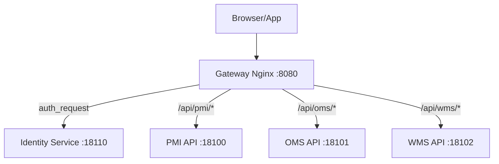

# Phase 5: Cleanup & Documentation

## Mục tiêu
- Xóa thư mục `nginx/`
- Cập nhật documentation
- Cập nhật CLAUDE.md

---

## Task 5.1: Xóa thư mục nginx/

**CHỈ THỰC HIỆN SAU KHI:**
- [ ] Gateway đã test thành công trên staging
- [ ] Đã deploy production và chạy ổn định 24h

```bash
# Backup trước (optional)
cp -r nginx/ nginx_backup_$(date +%Y%m%d)/

# Xóa
rm -rf nginx/

# Commit
git add -A
git commit -m "chore: remove legacy nginx/ directory, replaced by gateway/"
```

---

## Task 5.2: Cập nhật CLAUDE.md

**File:** `CLAUDE.md`

### 5.2.1 Cập nhật Port Map

```markdown
## Port Map

| Service | Host Port |
|---------|-----------|
| **Gateway (Nginx)** | **8080** (dev) / **80** (prod) |
| Identity API | 18110 |
| Identity Frontend | 13110 |
| PMI Postgres | 15433 |
| OMS Postgres | 15434 |
| WMS Postgres | 15435 |
| PMI API | 18100 |
| OMS API | 18101 |
| WMS API | 18102 |
| PMI Frontend | 13100 |
| OMS Frontend | 13101 |
| WMS Frontend | 13102 |
| PMI MinIO API | 19005 |
| PMI MinIO Console | 19006 |
| Web (storefront) | 3000 |
```

### 5.2.2 Cập nhật Gateway section

```markdown
### Gateway + Identity Service
- **Gateway** (`gateway/`): Nginx API Gateway with centralized auth
  - All `/api/*` routes validated via `/auth/verify` before proxying
  - Dev: path-based routing (`localhost:8080/api/pmi/*`)
  - Prod: subdomain-based routing (`api-pmi.topvnsport.com`)
  - Config: `nginx/conf.d/locations.conf` (dev), `locations.prod.conf` (prod)
- **Identity Service** (`identity-service/`): FastAPI SSO service
  - Manages users, roles, JWT tokens (access + refresh)
  - Routers: `auth.py`, `staff.py`, `roles.py`
  - Frontend: Next.js login/dashboard at port 13110
```

### 5.2.3 Cập nhật Commands section

```markdown
### Start Gateway + Identity (centralized auth)
\`\`\`bash
# Create networks first
docker network create pmi_default oms_default wms_default identity_default gateway_network 2>/dev/null || true

# Dev mode
cd gateway && docker compose up

# Production
cd gateway && docker compose -f docker-compose.prod.yml up -d
\`\`\`
```

### 5.2.4 Xóa references tới nginx/

Tìm và xóa/cập nhật các dòng mention `nginx/conf.d/`.

---

## Task 5.3: Cập nhật docs/

### 5.3.1 docs/architecture.md

Cập nhật Mermaid diagram:



### 5.3.2 Cập nhật các docs khác nếu mention nginx/

```bash
# Tìm files cần cập nhật
grep -r "nginx/" docs/ --include="*.md"
```

---

## Task 5.4: Cập nhật .gitignore (nếu cần)

```gitignore
# Gateway
gateway/nginx/conf.d/*.local.conf
```

---

## Task 5.5: Tạo README cho gateway/

**File:** `gateway/README.md` (cập nhật nếu đã có)

```markdown
# Gateway - API Gateway with SSO

API Gateway sử dụng Nginx với `auth_request` module để xác thực tập trung qua Identity Service.

## Quick Start

### Development
\`\`\`bash
# Tạo networks
docker network create pmi_default oms_default wms_default identity_default 2>/dev/null || true

# Start gateway + identity
docker compose up

# Test
curl http://localhost:8080/health
./test_auth.sh
\`\`\`

### Production
\`\`\`bash
docker compose -f docker-compose.prod.yml up -d
\`\`\`

## Architecture

### Dev (Path-based routing)
\`\`\`
localhost:8080/api/pmi/*  → PMI Backend
localhost:8080/api/oms/*  → OMS Backend
localhost:8080/api/wms/*  → WMS Backend
localhost:8080/auth/*     → Identity Service
\`\`\`

### Production (Subdomain routing)
\`\`\`
api-pmi.topvnsport.com  → PMI Backend
api-oms.topvnsport.com  → OMS Backend
api-wms.topvnsport.com  → WMS Backend
identity.topvnsport.com → Identity Service
\`\`\`

## Auth Flow

1. Client gửi request với `Authorization: Bearer <token>`
2. Gateway gọi `/auth/verify` tới Identity Service
3. Identity Service verify token, trả về user info trong headers
4. Gateway inject `X-User-*` headers và forward request tới backend
5. Backend đọc user info từ headers

## Endpoints

| Path | Auth | Backend |
|------|------|---------|
| `/auth/*` | No | Identity Service |
| `/api/pmi/public/*` | No | PMI (public data) |
| `/api/pmi/*` | Yes | PMI |
| `/api/oms/*` | Yes | OMS |
| `/api/wms/*` | Yes | WMS |
| `/internal/*` | X-API-Key | Service-to-service |
| `/health` | No | Health check |

## Files

| File | Purpose |
|------|---------|
| `docker-compose.yml` | Dev stack (gateway + identity) |
| `docker-compose.prod.yml` | Prod (gateway only) |
| `nginx/nginx.conf` | Main nginx config |
| `nginx/conf.d/upstream.conf` | Dev upstream servers |
| `nginx/conf.d/upstream.prod.conf` | Prod upstream servers |
| `nginx/conf.d/locations.conf` | Dev routes (path-based) |
| `nginx/conf.d/locations.prod.conf` | Prod routes (subdomain) |
| `test_auth.sh` | Auth flow test script |
| `test_gateway.sh` | Full integration test |
\`\`\`
```

---

## Checklist Phase 5

- [ ] Backup nginx/ trước khi xóa
- [ ] Xóa nginx/ sau khi prod ổn định
- [ ] Cập nhật CLAUDE.md
- [ ] Cập nhật docs/architecture.md
- [ ] Cập nhật gateway/README.md
- [ ] Commit và push changes

---

## Git commit messages gợi ý

```bash
# Sau khi hoàn thành Phase 1-4
git commit -m "feat(gateway): add production config with subdomain routing and auth"

# Sau khi xóa nginx/
git commit -m "chore: remove legacy nginx/ directory, replaced by gateway/"

# Sau khi update docs
git commit -m "docs: update architecture docs for gateway migration"
```
