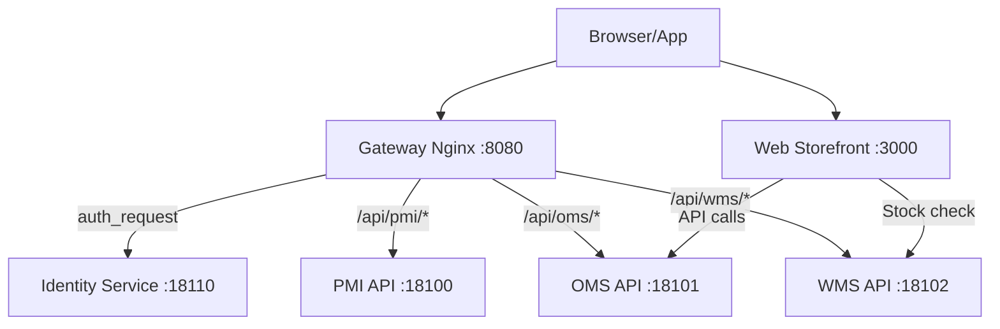
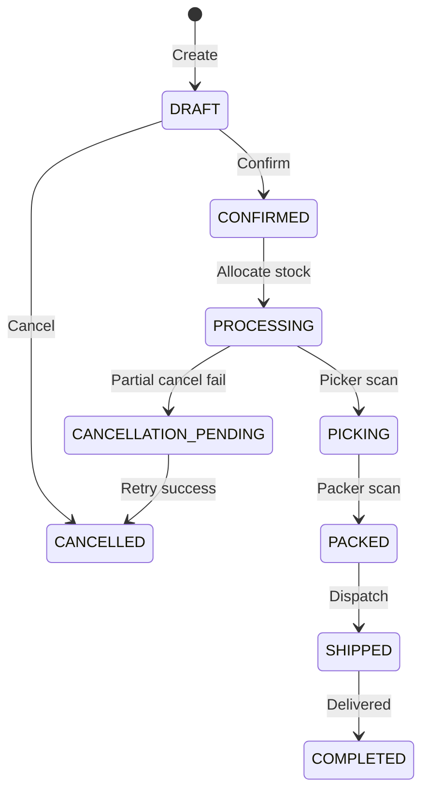
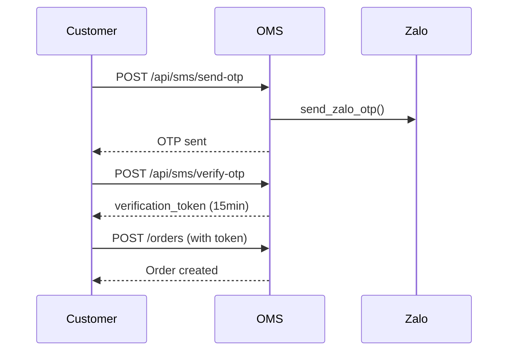

# TopVNSport System Architecture

## System Overview



## Component Architecture

```mermaid
graph TD
    subgraph PMI ["PMI - Port 13100/18100"]
        PMI_FE["Frontend :13100"]
        PMI_API["API :18100"]
        PMI_DB[("pim_db :15433")]
        PMI_MinIO[("MinIO :19005")]
        PMI_FE --> PMI_API --> PMI_DB
        PMI_API --> PMI_MinIO
    end

    subgraph OMS ["OMS - Port 13101/18101"]
        OMS_FE["Frontend :13101"]
        OMS_API["API :18101"]
        OMS_DB[("oms_db :15434")]
        OMS_FE --> OMS_API --> OMS_DB
    end

    subgraph WMS ["WMS - Port 13102/18102"]
        WMS_FE["Desktop :13102"]
        WMS_MOB["Mobile /m/*"]
        WMS_API["API :18102"]
        WMS_DB[("wms_db :15435")]
        WMS_FE --> WMS_API
        WMS_MOB --> WMS_API
        WMS_API --> WMS_DB
    end

    OMS_API -.->|GET /products/by-sku| PMI_API
    OMS_API ==>|POST /fulfillment-orders| WMS_API
    WMS_API -.->|GET /products/by-sku| PMI_API
    WMS_API ==>|PATCH /orders/{id}/status| OMS_API
```

## Service Responsibilities

| Service | Port | Responsibility |
|---------|------|----------------|
| **Identity** | 18110 | JWT auth, user/role management, SSO |
| **PMI** | 18100 | Products, categories, attributes, media (MinIO) |
| **OMS** | 18101 | Orders, customers, channels, Zalo OTP, fulfillment coordination |
| **WMS** | 18102 | Inventory, locations, inbound/outbound, barcode mapping |
| **Web** | 3000 | Customer storefront (Vite+React) |
| **Gateway** | 8080 | Nginx reverse proxy with auth_request |

## Order Lifecycle



## Key Flows

### Outbound (Order Fulfillment)

1. **OMS**: Create order (DRAFT)
2. **OMS**: Staff confirms -> check WMS stock
3. **OMS**: POST /fulfillment-orders to WMS
4. **WMS**: Create pick list, reserve qty
5. **WMS Mobile**: Picker scans EAN-13 barcode
6. **WMS**: Callback OMS -> PICKING
7. **WMS Mobile**: Packer scans tracking code
8. **WMS**: Callback OMS -> PACKED -> SHIPPED

### Inbound (Receiving)

1. **WMS**: Create InboundShipment
2. **WMS**: Validate SKUs via PMI
3. **WMS Mobile**: Scan EAN-13 on products
4. **WMS**: Map barcode to SKU if new
5. **WMS Mobile**: Scan location code for put-away
6. **WMS**: Update qty_on_hand

### OTP Verification (Storefront)



## Barcode Types

| Type | Format | Usage |
|------|--------|-------|
| **Product** | EAN-13 | On product boxes, mapped to SKU |
| **Tracking** | Code128/QR | Shipping labels from carriers |
| **Location** | Custom | `A01-K02-T01` = Zone A, Aisle 1, Rack 2, Shelf 1 |

## Database Ports

| System | Host Port | Container |
|--------|-----------|-----------|
| PMI | 15433 | pim-db:5432 |
| OMS | 15434 | oms-db:5432 |
| WMS | 15435 | wms-db:5432 |
| Identity | 15436 | identity-db:5432 |

## Inter-Service APIs

| From | To | Endpoint | Purpose |
|------|------|----------|---------|
| OMS | PMI | GET /api/products/by-sku/{sku} | Validate product, get price |
| OMS | WMS | POST /fulfillment-orders | Create fulfillment |
| OMS | WMS | POST /fulfillment-orders/{id}/cancel | Cancel fulfillment |
| WMS | OMS | PATCH /orders/{id}/status | Status callback |
| WMS | PMI | GET /api/products/by-sku/{sku} | Validate SKU |
| Web | WMS | GET /public/stock | Check available stock |

## Authentication

- **Gateway auth_request**: All /api/* routes verified via Identity
- **Internal calls**: X-API-Key header between services
- **Storefront**: OTP verification -> verification_token -> order creation
