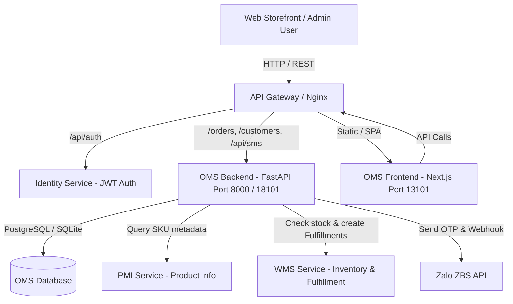
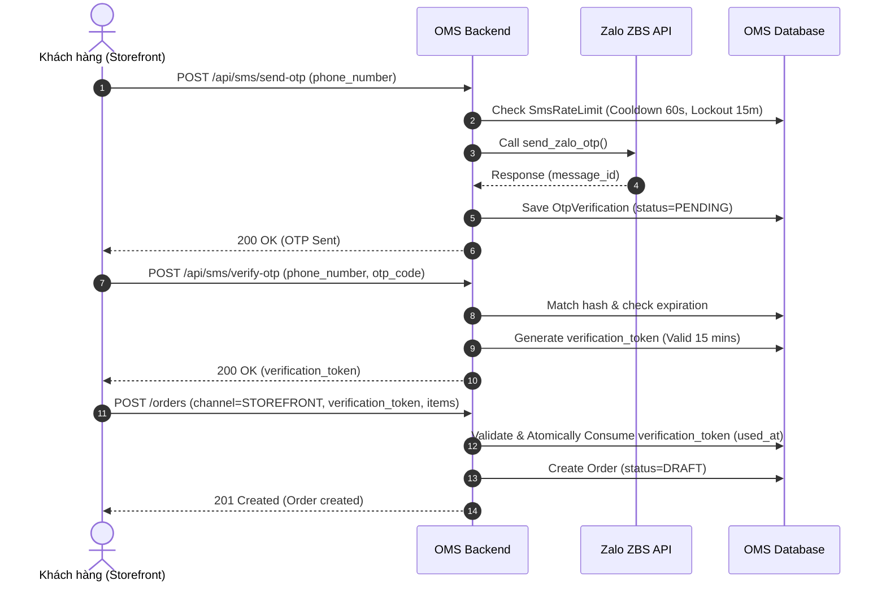
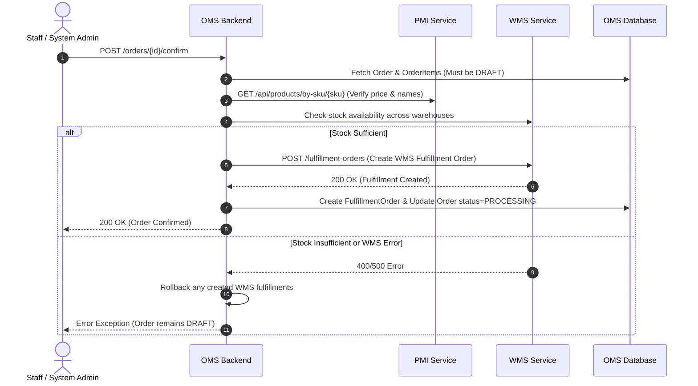
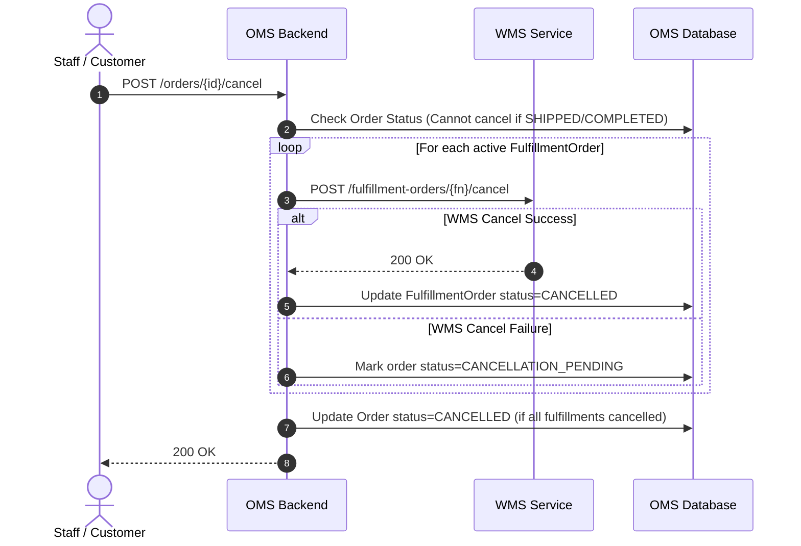
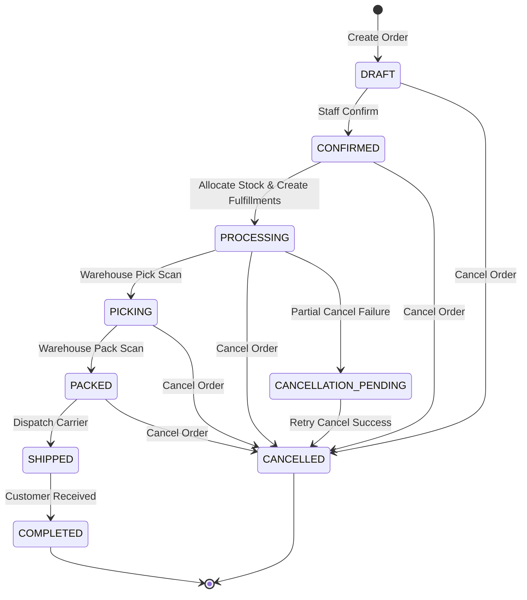

# TopVNSport OMS - System Architecture Documentation

Tài liệu kiến trúc hệ thống tổng thể của TopVNSport Order Management System (OMS).

---

## Table of Contents

- [Architectural Overview](#architectural-overview)
- [System Context & Component Diagram](#system-context-component-diagram)
- [Core Service Responsibilities](#core-service-responsibilities)
- [Core Business Workflows](#core-business-workflows)
  - [1. Storefront OTP Authentication & Order Creation](#1-storefront-otp-authentication-order-creation)
  - [2. Order Confirmation & WMS Inventory Allocation](#2-order-confirmation-wms-inventory-allocation)
  - [3. Order Cancellation & Fulfillment Rollback](#3-order-cancellation-fulfillment-rollback)
  - [4. Zalo Token Background Scheduler & Security](#4-zalo-token-background-scheduler-security)
- [Order Lifecycle State Machine](#order-lifecycle-state-machine)
- [Related Documentation](#related-documentation)

---

## Architectural Overview

TopVNSport OMS đóng vai trò làm trung tâm điều phối đơn hàng đa kênh (Omnichannel Order Hub) cho thương hiệu thể thao TopVNSport. Hệ thống nhận đơn hàng từ nhiều nguồn khác nhau (Web Storefront, Shopee, Lazada, TikTok Shop, và Sales Admin nhập tay), thực hiện xác thực khách hàng qua Zalo OTP, tự động liên kết dữ liệu danh mục sản phẩm từ PMI, kiểm tra và giữ hàng tồn kho realtime từ WMS, và phát lệnh xuất kho (Fulfillment Orders).

---

## System Context & Component Diagram

---

## Core Service Responsibilities

1. **OMS Backend (FastAPI - Port 8000 / 18101)**:
   - Quản lý vòng đời đơn hàng, khách hàng, kênh bán hàng và cấu hình hệ thống.
   - Xử lý xác thực người dùng qua Gateway Headers, JWT Bearer Token, hoặc `X-API-Key`.
   - Xử lý gửi/xác minh mã OTP qua Zalo ZBS API với Rate Limiting (Cooldown 60s, Lockout 15m).
   - Mã hóa Fernet (`EncryptedString`) cho các token/cấu hình nhạy cảm trong `system_configs`.
   - Giao tiếp với PMI để lấy giá và tên sản phẩm.
   - Giao tiếp với WMS để phân bổ hàng hóa theo kho và phát hành lệnh xuất kho (`FulfillmentOrder`).

2. **OMS Frontend (Next.js - Port 13101)**:
   - Giao diện quản trị OMS cho bộ phận Vận hành, CSKH và Quản lý kho.
   - Dashboard thống kê KPI kinh doanh realtime, báo cáo doanh thu và sản lượng đơn hàng.
   - Quản lý đơn hàng, duyệt đơn nháp, phân kho và cập nhật trạng thái đơn hàng.

3. **Zalo ZBS Integration**:
   - Gửi mã xác thực OTP 6 chữ số qua tin nhắn Zalo OA ZBS.
   - Nhận Webhook xác nhận tin nhắn đã đến thiết bị người dùng.
   - Tự động xoay vòng Access Token / Refresh Token định kỳ 20 giờ qua Background Scheduler (`APScheduler`).

---

## Core Business Workflows

### 1. Storefront OTP Authentication & Order Creation

---

### 2. Order Confirmation & WMS Inventory Allocation

---

### 3. Order Cancellation & Fulfillment Rollback

---

### 4. Zalo Token Background Scheduler & Security

Hệ thống tích hợp `APScheduler` chạy background job `refresh_zalo_tokens_job` mỗi **20 giờ**:
- Tự động đọc `zalo_refresh_token`, `zalo_app_id` và secret từ database.
- Gửi yêu cầu đổi token mới sang Zalo OAuth Server.
- Cập nhật nguyên tử (`atomically`) cặp token mới vào bảng `system_configs` với kiểu dữ liệu `EncryptedString` (Fernet).

---

## Order Lifecycle State Machine

Đơn hàng tuân thủ nghiêm ngặt các bước chuyển trạng thái một chiều (`ALLOWED_TRANSITIONS`):

---

## Related Documentation

- [API Reference Documentation](API.md)
- [Database Schema Documentation](DATABASE.md)
- [Project Overview README](../README.md)
