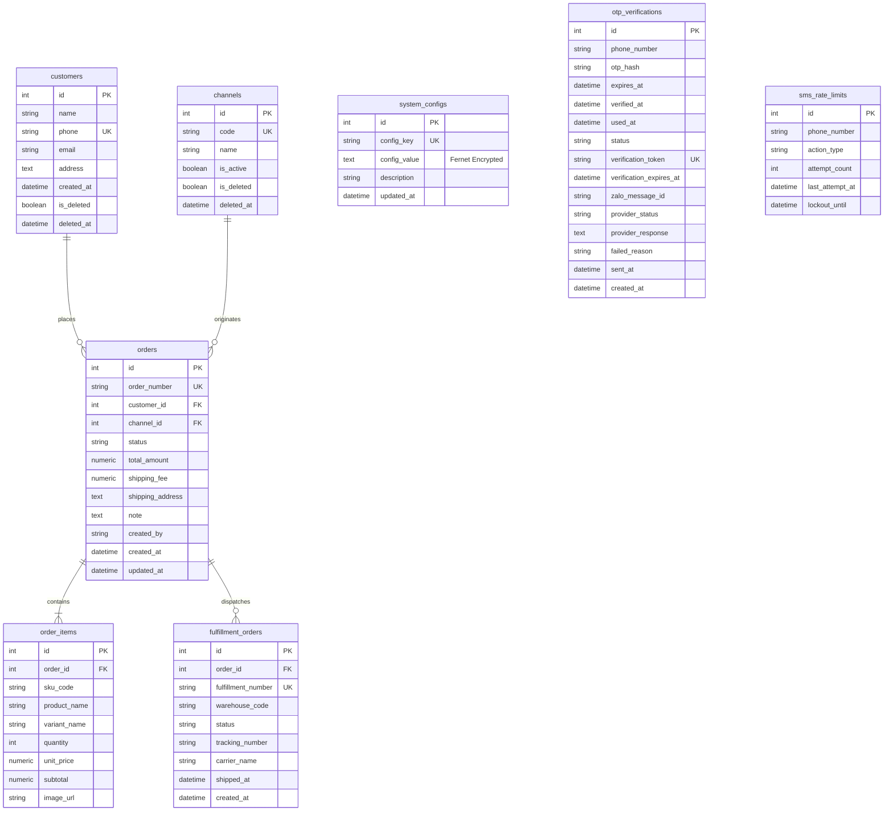

# TopVNSport OMS - Database Schema Documentation

Tài liệu chi tiết cấu trúc Database, các ORM Models (SQLAlchemy), và lịch sử Alembic Migrations của hệ thống TopVNSport OMS.

---

## Table of Contents

- [Overview & Migration Engine](#overview-migration-engine)
- [Alembic Migration History](#alembic-migration-history)
- [Entity-Relationship Diagram (ERD)](#entity-relationship-diagram-erd)
- [Table Schemas](#table-schemas)
  - [1. `customers`](#1-customers)
  - [2. `channels`](#2-channels)
  - [3. `orders`](#3-orders)
  - [4. `order_items`](#4-order_items)
  - [5. `fulfillment_orders`](#5-fulfillment_orders)
  - [6. `system_configs`](#6-system_configs)
  - [7. `otp_verifications`](#7-otp_verifications)
  - [8. `sms_rate_limits`](#8-sms_rate_limits)
- [Security & Encryption at Rest](#security-encryption-at-rest)
- [Business Invariants & Soft Deletion](#business-invariants-soft-deletion)
- [Related Documentation](#related-documentation)

---

## Overview & Migration Engine

OMS Schema sử dụng **PostgreSQL** (hoặc SQLite cho testing) và được quản lý hoàn toàn tự động bằng **Alembic**.

- **ORM Engine**: SQLAlchemy 2.x
- **Migration Location**: `OMS/backend/alembic/versions`
- **Rule**: Không gọi `Base.metadata.create_all()` ở startup. Tất cả thay đổi schema bắt buộc phải áp dụng qua Alembic migration script.

---

## Alembic Migration History

| Revision ID | Description | Key Changes |
| --- | --- | --- |
| `0001_baseline_oms_schema` | Baseline OMS Schema | Khởi tạo 8 bảng chính: `customers`, `channels`, `orders`, `order_items`, `fulfillment_orders`, `system_configs`, `otp_verifications`, `sms_rate_limits`. |
| `0002_add_zalo_message_id` | Add Zalo Message ID | Thêm cột `zalo_message_id` (String 100, Indexed) vào bảng `otp_verifications` để truy vết webhook. |
| `0003_config_value_text` | Config Value Text | Chuyển kiểu dữ liệu `config_value` trong `system_configs` thành `TEXT` để chứa ciphertext mã hóa Fernet. |
| `0004_add_customer_soft_delete` | Add Customer Soft Delete | Thêm cột `is_deleted` (Boolean, default False) và `deleted_at` (DateTime) vào bảng `customers`. |
| `0005_add_channel_soft_delete` | Add Channel Soft Delete | Thêm cột `is_deleted` (Boolean, default False) và `deleted_at` (DateTime) vào bảng `channels`. |

---

## Entity-Relationship Diagram (ERD)

---

## Table Schemas

### 1. `customers`
Lưu trữ thông tin khách hàng mua hàng trên hệ thống.

| Column Name | Data Type | Nullable | Constraints / Index | Description |
| --- | --- | --- | --- | --- |
| `id` | `Integer` | No | Primary Key, Indexed | Auto-incrementing ID |
| `name` | `String` | No | - | Tên khách hàng |
| `phone` | `String` | No | Unique, Indexed | Số điện thoại duy nhất |
| `email` | `String` | Yes | - | Địa chỉ email (optional) |
| `address` | `Text` | Yes | - | Địa chỉ giao hàng mặc định |
| `created_at` | `DateTime` | No | Default: UTC Now | Thời gian khởi tạo |
| `is_deleted` | `Boolean` | No | Default: `False` | Trạng thái soft delete |
| `deleted_at` | `DateTime` | Yes | - | Thời điểm thực hiện soft delete |

---

### 2. `channels`
Lưu trữ các kênh bán hàng (Shopee, TikTok Shop, Lazada, Storefront, Manual).

| Column Name | Data Type | Nullable | Constraints / Index | Description |
| --- | --- | --- | --- | --- |
| `id` | `Integer` | No | Primary Key, Indexed | Auto-incrementing ID |
| `code` | `String` | No | Unique, Indexed | Mã kênh (ví dụ: `SHOPEE`, `STOREFRONT`) |
| `name` | `String` | No | - | Tên hiển thị của kênh bán |
| `is_active` | `Boolean` | No | Default: `True` | Kênh có đang hoạt động hay không |
| `is_deleted` | `Boolean` | No | Default: `False` | Trạng thái soft delete |
| `deleted_at` | `DateTime` | Yes | - | Thời điểm thực hiện soft delete |

---

### 3. `orders`
Lưu trữ thông tin đơn hàng tổng quát.

| Column Name | Data Type | Nullable | Constraints / Index | Description |
| --- | --- | --- | --- | --- |
| `id` | `Integer` | No | Primary Key, Indexed | Auto-incrementing ID |
| `order_number` | `String` | No | Unique, Indexed | Mã đơn hàng (ví dụ: `ORD-20260728-0001`) |
| `customer_id` | `Integer` | No | Foreign Key (`customers.id`) | ID khách hàng đặt đơn |
| `channel_id` | `Integer` | No | Foreign Key (`channels.id`) | ID kênh bán tạo đơn |
| `status` | `String` | No | - | Trạng thái đơn (`DRAFT`, `CONFIRMED`, `PROCESSING`, `PICKING`, `PACKED`, `SHIPPED`, `COMPLETED`, `CANCELLED`, `CANCELLATION_PENDING`) |
| `total_amount` | `Numeric(10,2)`| No | - | Tổng giá trị đơn hàng (Bao gồm phí vận chuyển) |
| `shipping_fee` | `Numeric(10,2)`| No | - | Phí vận chuyển |
| `shipping_address`| `Text` | No | - | Địa chỉ nhận hàng |
| `note` | `Text` | Yes | - | Ghi chú đơn hàng |
| `created_by` | `String` | Yes | - | Tên người tạo đơn hoặc hệ thống tạo (`storefront`) |
| `created_at` | `DateTime` | No | Default: UTC Now | Thời điểm tạo đơn |
| `updated_at` | `DateTime` | No | Default: UTC Now | Thời điểm cập nhật cuối |

---

### 4. `order_items`
Lưu trữ thông tin chi tiết từng sản phẩm/SKU trong đơn hàng.

| Column Name | Data Type | Nullable | Constraints / Index | Description |
| --- | --- | --- | --- | --- |
| `id` | `Integer` | No | Primary Key, Indexed | Auto-incrementing ID |
| `order_id` | `Integer` | No | Foreign Key (`orders.id`) | ID đơn hàng cha (Cascade Delete) |
| `sku_code` | `String` | No | - | Mã SKU sản phẩm |
| `product_name` | `String` | No | - | Tên sản phẩm |
| `variant_name` | `String` | Yes | - | Tên biến thể (màu sắc, kích thước) |
| `quantity` | `Integer` | No | - | Số lượng đặt mua |
| `unit_price` | `Numeric(10,2)`| No | - | Đơn giá tại thời điểm mua |
| `subtotal` | `Numeric(10,2)`| No | - | Thành tiền = `quantity * unit_price` |
| `image_url` | `String` | Yes | - | URL ảnh minh họa sản phẩm |

---

### 5. `fulfillment_orders`
Lưu trữ các lệnh xuất kho gửi sang WMS để đóng gói và giao hàng.

| Column Name | Data Type | Nullable | Constraints / Index | Description |
| --- | --- | --- | --- | --- |
| `id` | `Integer` | No | Primary Key, Indexed | Auto-incrementing ID |
| `order_id` | `Integer` | No | Foreign Key (`orders.id`) | ID đơn hàng cha |
| `fulfillment_number`| `String` | No | Unique, Indexed | Mã lệnh xuất kho (ví dụ: `FM-ORD-20260728-0001-1`) |
| `warehouse_code` | `String` | No | - | Mã kho xuất hàng |
| `status` | `String` | No | - | Trạng thái lệnh xuất kho (`PENDING`, `PICKING`, `PACKED`, `SHIPPED`, `CANCELLED`) |
| `tracking_number` | `String` | Yes | - | Mã vận đơn của đơn vị vận chuyển |
| `carrier_name` | `String` | Yes | - | Tên đơn vị vận chuyển |
| `shipped_at` | `DateTime` | Yes | - | Thời điểm xuất kho giao hàng |
| `created_at` | `DateTime` | No | Default: UTC Now | Thời điểm tạo lệnh |

---

### 6. `system_configs`
Lưu trữ cấu hình hệ thống (Zalo OA App ID, App Secret, Access Token, Refresh Token, Template ID).

| Column Name | Data Type | Nullable | Constraints / Index | Description |
| --- | --- | --- | --- | --- |
| `id` | `Integer` | No | Primary Key, Indexed | Auto-incrementing ID |
| `config_key` | `String(100)`| No | Unique, Indexed | Tên khóa cấu hình (`zalo_app_id`, `zalo_access_token`, ...) |
| `config_value` | `Text` | Yes | Encrypted via Fernet | Giá trị cấu hình (đã mã hóa) |
| `description` | `String(255)`| Yes | - | Mô tả khóa cấu hình |
| `updated_at` | `DateTime` | No | Default: UTC Now | Thời điểm cập nhật cuối |

---

### 7. `otp_verifications`
Lưu vết các lượt gửi và xác minh mã OTP của khách hàng.

| Column Name | Data Type | Nullable | Constraints / Index | Description |
| --- | --- | --- | --- | --- |
| `id` | `Integer` | No | Primary Key, Indexed | Auto-incrementing ID |
| `phone_number` | `String(20)` | No | Indexed | Số điện thoại nhận OTP |
| `otp_hash` | `String(255)`| No | - | Mã băm SHA-256 của mã OTP |
| `expires_at` | `DateTime` | No | - | Thời điểm hết hạn mã OTP (5 phút) |
| `verified_at` | `DateTime` | Yes | - | Thời điểm xác minh OTP thành công |
| `used_at` | `DateTime` | Yes | - | Thời điểm token được dùng để tạo đơn Storefront |
| `status` | `String(50)` | Yes | - | Trạng thái tiêu thụ token (`CONSUMED`) |
| `verification_token`| `String(255)`| Yes | Unique, Indexed | Token UUIDv4 được cấp sau khi nhập đúng OTP |
| `verification_expires_at`| `DateTime`| Yes | - | Thời điểm hết hạn verification token (15 phút) |
| `zalo_message_id`| `String(100)`| Yes | Indexed | Mã tin nhắn phản hồi từ Zalo ZBS API |
| `provider_status`| `String(50)`| Yes | - | Trạng thái gửi tin từ provider (`PENDING`, `success`, `DELIVERED`, `failed`) |
| `provider_response`| `Text` | Yes | - | JSON response từ Zalo ZBS API |
| `failed_reason`| `String(255)`| Yes | - | Lý do thất bại khi gửi OTP |
| `sent_at` | `DateTime` | Yes | - | Thời điểm gửi tin nhắn thành công |
| `created_at` | `DateTime` | No | Default: UTC Now | Thời điểm khởi tạo bản ghi |

---

### 8. `sms_rate_limits`
Quản lý giới hạn tần suất gửi và xác minh OTP theo số điện thoại.

| Column Name | Data Type | Nullable | Constraints / Index | Description |
| --- | --- | --- | --- | --- |
| `id` | `Integer` | No | Primary Key, Indexed | Auto-incrementing ID |
| `phone_number` | `String(20)` | No | Indexed | Số điện thoại áp dụng giới hạn |
| `action_type` | `String(50)` | No | - | Loại hành động: `'send'` hoặc `'verify'` |
| `attempt_count` | `Integer` | No | Default: 1 | Số lần thực hiện trong cửa sổ thời gian |
| `last_attempt_at`| `DateTime` | No | Default: UTC Now | Thời điểm thử lần cuối |
| `lockout_until` | `DateTime` | Yes | - | Thời điểm hết khóa tạm thời (Khóa 15 phút nếu thử sai 5 lần) |

---

## Security & Encryption at Rest

Giá trị trong bảng `system_configs.config_value` được mã hóa đối xứng ở mức ứng dụng (Application-Level Encryption) bằng thư viện `cryptography.fernet.Fernet`.

- **Mã hóa**: Khi ghi vào DB, `EncryptedString` mã hóa chuỗi plaintext bằng `FERNET_KEY`.
- **Giải mã**: Khi đọc từ DB, `EncryptedString` giải mã ciphertext thành chuỗi ban đầu.
- **Yêu cầu môi trường**: Ứng dụng sẽ báo lỗi nếu không có biến môi trường `FERNET_KEY` hợp lệ.

---

## Business Invariants & Soft Deletion

1. **Customer Soft Delete**:
   - Khách hàng bị xóa sẽ đánh dấu `is_deleted = True` và lưu `deleted_at`.
   - Nếu khách hàng đang có đơn hàng chưa hoàn tất/chưa hủy (`status notin ('CANCELLED', 'COMPLETED')`), hệ thống chặn xóa và trả về `409 Conflict`.
   - Nếu tạo mới khách hàng với số điện thoại đã tồn tại nhưng đã bị soft-delete, hệ thống tự động khôi phục (`is_deleted = False`, `deleted_at = None`) và cập nhật thông tin mới.

2. **Channel Soft Delete**:
   - Kênh bán hàng bị xóa sẽ đánh dấu `is_deleted = True` và lưu `deleted_at`.
   - Chặn xóa kênh bán hàng (`409 Conflict`) nếu còn đơn hàng đang hoạt động liên kết với kênh đó.

---

## Related Documentation

- [API Reference Documentation](API.md)
- [System Architecture Documentation](ARCHITECTURE.md)
- [Project Overview README](../README.md)
