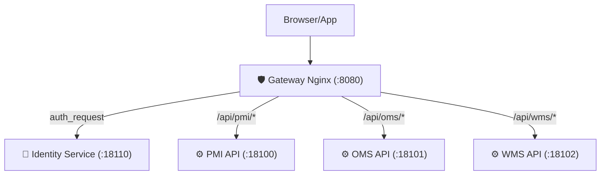
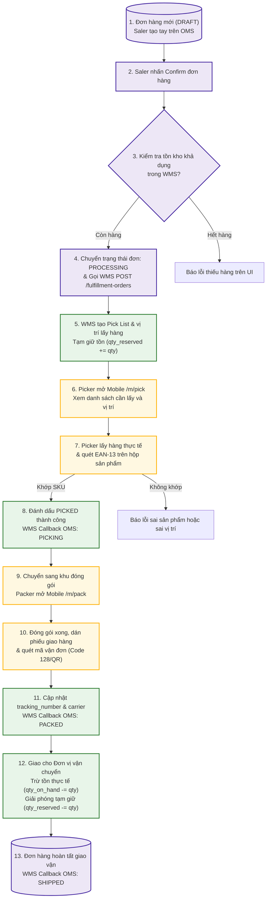
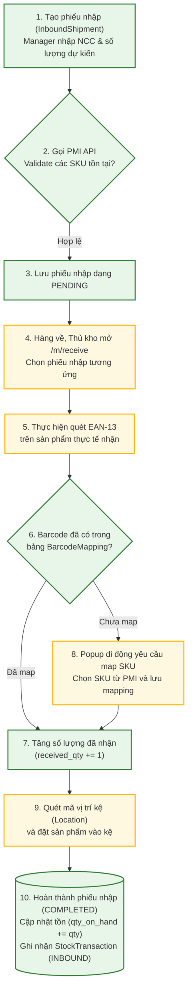
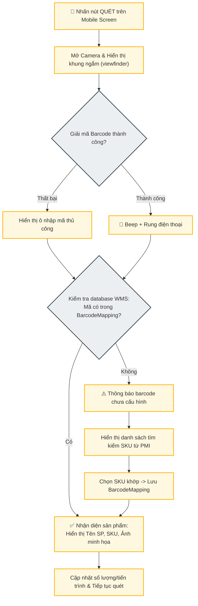

# Kiến Trúc Hệ Thống PMI + OMS + WMS (TOP VN SPORT)

Tài liệu này mô tả chi tiết kiến trúc hệ thống và toàn bộ luồng nghiệp vụ của chuỗi hệ thống **PMI + OMS + WMS** bằng sơ đồ Mermaid.

### Sơ đồ định tuyến qua Gateway (Centralized Auth & Routing)



## 2. Kiến Trúc Chi Tiết Các Thành Phần (System Components Architecture)

Sơ đồ dưới đây biểu diễn 3 hệ thống chạy độc lập dưới dạng Microservices, các thành phần bên trong (Frontend, API, DB), phân quyền tác vụ của từng đối tượng (Saler, Thủ kho, Packer) và các kênh giao tiếp API giữa các service.

```mermaid
graph TD
    %% Định nghĩa Style cho đẹp mắt và đồng bộ
    classDef pmiClass fill:#E3F2FD,stroke:#1565C0,stroke-width:2px;
    classDef omsClass fill:#EDE7F6,stroke:#4527A0,stroke-width:2px;
    classDef wmsClass fill:#E8F5E9,stroke:#2E7D32,stroke-width:2px;
    classDef actorClass fill:#FFF3E0,stroke:#EF6C00,stroke-width:2px;
    classDef extClass fill:#ECEFF1,stroke:#37474F,stroke-dasharray: 5 5;
    
    subgraph PMI ["PMI (Product Information Management) - Port 13100/18100"]
        PMI_FE["💻 PMI Frontend (:13100)<br/>Quản lý thông tin & media sản phẩm"]:::pmiClass
        PMI_API["⚙️ PMI API (:18100)<br/>FastAPI Product Service"]:::pmiClass
        PMI_DB[("🗄️ Database: pim_db<br/>(Postgres :15433)")]:::pmiClass
        PMI_MinIO[("📦 MinIO Object Storage<br/>(Media :19005)")]:::pmiClass
        
        PMI_FE --> PMI_API
        PMI_API --> PMI_DB
        PMI_API --> PMI_MinIO
    end

    subgraph OMS ["OMS (Order Management System) - Port 13101/18101"]
        OMS_FE["💻 OMS Frontend (:13101)<br/>Dashboard, Order CRUD, Channels, Customer"]:::omsClass
        OMS_API["⚙️ OMS API (:18101)<br/>FastAPI Order Service"]:::omsClass
        OMS_DB[("🗄️ Database: oms_db<br/>(Postgres :15434)")]:::omsClass
        
        OMS_FE --> OMS_API
        OMS_API --> OMS_DB
    end

    subgraph WMS ["WMS (Warehouse Management System) - Port 13102/18102"]
        WMS_FE["💻 WMS Desktop (:13102)<br/>Quản lý vị trí, kiểm kho, inbound"]:::wmsClass
        WMS_MOB["📱 WMS Mobile Scanner (/m/*)<br/>PWA Quét barcode di động"]:::wmsClass
        WMS_API["⚙️ WMS API (:18102)<br/>FastAPI Inventory Service"]:::wmsClass
        WMS_DB[("🗄️ Database: wms_db<br/>(Postgres :15435)")]:::wmsClass
        
        WMS_FE --> WMS_API
        WMS_MOB --> WMS_API
        WMS_API --> WMS_DB
    end

    %% Các Tác Nhân (Actors)
    Saler["👤 Nhân viên Bán Hàng (Saler)"]:::actorClass
    WarehouseManager["👤 Quản lý Kho (Manager)"]:::actorClass
    Picker["👤 Nhân viên lấy hàng (Picker)"]:::actorClass
    Packer["👤 Nhân viên đóng gói (Packer)"]:::actorClass
    
    Saler -->|Tạo & xác nhận đơn| OMS_FE
    WarehouseManager -->|Tạo phiếu nhập / Cấu hình kho| WMS_FE
    Picker -->|Xác nhận lấy hàng trên mobile| WMS_MOB
    Packer -->|Xác nhận đóng gói trên mobile| WMS_MOB

    %% Liên Kết Tương Tác Giữa Các Service
    OMS_API -.->|1. GET /api/products/by-sku/{sku}<br/>Validate sản phẩm| PMI_API
    OMS_API ===>|2. POST /fulfillment-orders<br/>Tạo lệnh xuất kho| WMS_API
    
    WMS_API -.->|3. GET /api/products/by-sku/{sku}<br/>Validate & Đồng bộ SP| PMI_API
    WMS_API ===>|4. PATCH /orders/{id}/status<br/>Callback trạng thái đơn hàng<br/>(PICKING/PACKED/SHIPPED)| OMS_API
    
    OMS_API -.->|5. POST /fulfillment-orders/.../cancel<br/>Hủy lệnh xuất| WMS_API
```

## 2. Luồng Nghiệp Vụ 1: Xuất Kho (Outbound Flow)

Luồng đi từ khi tạo đơn hàng thủ công trên OMS, xác nhận để đẩy qua WMS lập phiếu xuất, thực hiện pick-pack bằng thiết bị di động (quét barcode EAN-13 và Code 128 vận đơn) và cập nhật ngược lại OMS.



## 3. Luồng Nghiệp Vụ 2: Nhập Kho (Inbound Flow)

Luồng nhập hàng hóa từ nhà cung cấp về kho, quét barcode kiểm tra số lượng và đưa hàng vào các vị trí kệ (Put-away).



## 4. Luồng Nghiệp Vụ 3: Thiết Kế Quét & Mapping Barcode Di Động (Mobile Scanning & Mapping Flow)

Cơ chế quét di động sử dụng camera để tự động map barcode EAN-13 chưa cấu hình vào SKU của PMI, giảm thiểu thao tác nhập tay.



## Giải thích các loại Barcode trong hệ thống:
1. **Barcode Sản Phẩm (EAN-13)**: In sẵn trên vỏ hộp sản phẩm cầu lông của Yonex, Victor, Li-Ning (gồm 13 chữ số). Được map với SKU của PMI thông qua bảng `BarcodeMapping` trong WMS.
2. **Barcode Vận Đơn (Code 128 / QR)**: In trên phiếu giao hàng của các đơn vị vận chuyển (Shopee Express, GHTK, GHN, TikTok Shop...). Hệ thống quét mã này ở bước đóng gói (`packing`) để tự động điền `tracking_number` và chuyển trạng thái sang `PACKED`.
3. **Barcode Vị Trí (Location Code)**: Mã hóa dưới dạng `[Zone][Aisle]-K[Rack]-T[Shelf]` (Ví dụ: `A01-K02-T01` - Khu A, lối đi 1, kệ 2, tầng 1). Dán trực tiếp tại các vị trí kệ trong kho để thủ kho quét xác nhận vị trí khi nhập kho (Put-away) hoặc lấy hàng (Picking).
